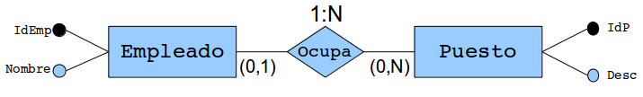
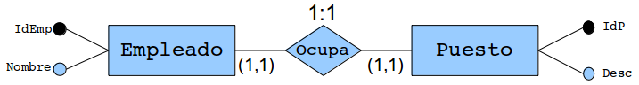
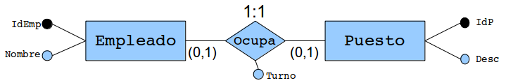
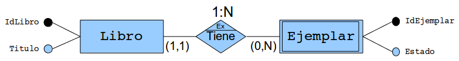
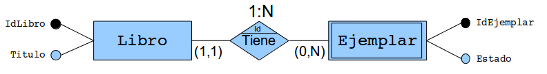
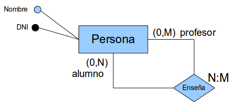
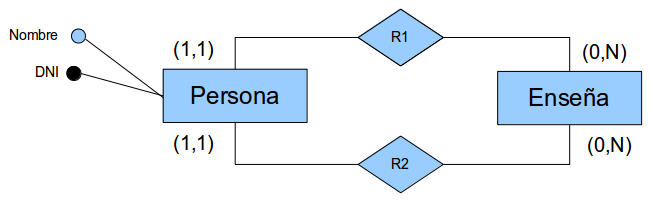

#Paso del modelo entidad-relación al modelo lógico

#Índice

[TOC]

#Introducción
Vamos a ver el paso del MER a tablas o también el paso de tablas a MER. En todos los libros, el modelo de trabajo es: partiendo de la especificación de requisitos realizamos el MER; del MER obtenemos de manera automatizada las tablas y con estas hacemos la BD, también de manera automatizada. Sin embargo, hay diseñadores a los que les gusta hacer directamente las tablas, sobre todo si el problema no es muy grande. A veces, en este último caso hay que hacer el MER, porque estamos en una prueba (oposición, prueba para obtener un trabajo, etc) o porque el cliente nos lo exige, en este último caso, hay diseñadores que a partir de las tablas, obtienen el MER. En este documento veremos tanto del paso de MER a tablas como el de tablas a MER.

#Notas
En color azul: atributos que añadimos a las tablas para representar una relación.
En color rojo: partes del MER que no pueden expresar las tablas.
En color verde: pasos que debemos seguir para convertir una relación en tablas.

CP: Clave Principal
CAJ: Clave Ajena
CALT: Clave Alternativa
VNN: Valores no nulos
UNIQUE: Valores únicos (índice)

MER: Modelo Entidad Relación

Las CP se han definido como VNN ya que es lo que dice el estándar SQL, aunque en MySQL no es obligatorio hacerlo.

Suponemos que nuestro SGBD tiene disponibles las restricciones de integridad de CP, CAJ, CALT, VNN y UNIQUE.

VNN → No permite valores nulos
UNIQUE → No permite valores repetidos, pero sí permite nulos
CP → UNIQUE + VNN
CALT → CP
CAJ → El valor debe estar en el campo y la tabla referenciados. Sí permite nulos.

Dependiendo del SGBD que usemos, incluso del motor de BD dentro de ese SGBD podemos tener más o menos restricciones de integridad disponibles.

#Entidades

```Ruby
EMPLEADO (
	DNI     VARCHAR(10) VNN
	Nombre  VARCHAR(50) VNN
	Ape_1   VARCHAR(50) VNN
	Ape_2   VARCHAR(50) VNN
	NSS     VARCHAR(10) VNN
	Fecha_nac  DATE()
	Sueldo:    Decimal(7,2)
	Telefono   VARCHAR(12)

	CP(DNI)
	UNIQUE(NSS)
)
```
El atributo Teléfono no lo hemos hecho multivaluado. Veremos más adelante cómo conseguirlo.
#Relaciones N:M
##Relación (0,N)-(0,M)

```Ruby
Empleado (
	IdEmp   INT         VNN
	Nombre  VARCHAR(50) VNN
    CP(IdEmp)
Puesto (
	IdP  INT  VNN
	Desc VARCHAR(50)
	CP(IdP)
)
Ocupa (
	Empleado: INT VNN
	Puesto:   INT VNN
	Turno:    VARCHAR(50) VNN
	CP(Empleado,Puesto)
	CAJ Empleado->Empleado.IdEmp
	CAJ Puesto  ->Puesto.CodP
)
```
**NOTAS:**
- En todos los casos el atributo turno se va a la tabla nueva.
- Las CAJ se definen como VNN porque la CP es la unión de las dos CP de cada una de las tablas. Cuando la CP es la unión de dos campos, se permite que sólo uno de ellos pueda ser nulo. Para evitar que podamos dejar uno de los campos de la CP en nulo, les pondremos VNN.
- El atributo obligatorio Turno se define como VNN. Si fuera opcional, no se haría.

**Resumen:**
- Crear una tabla nueva con las CP de cada una de las tablas y definirlas como CAJ y VNN. Definir como CP de la nueva tabla la unión de las dos CP de cada una de las tablas.

##Relación (1,N)-(0,M)

La solución es exáctamente igual que la anterior ya que en ningún caso podemos representar las restricciones 1,N con las restricciones que tenemos disponible. Como norma general, no se usarán restricciones 1,N, pero si es imprescindible, tendremos que hacer que esa restricción se cumpla desde la aplicación o desde disparadores en la propia BD.
Para que esta restricción se cumpla desde la aplicación debemos comprobar que:
1. Cada vez que se cree un *Puesto*, deberá tener ya asignado un empleado
2. Cada vez que se borre un *Empleado*, se deberá comprobar si es el último empleado asignado a un puesto. En tal caso, no se permitirá el borrado de dicho empleado.

##Relación (0,N)-(1,M)

Es el mismo caso anterior pero con la restricción 1,M, que no se puede cumplir al otro lado.

##Relación (1,N)-(1,M)

Al igual que en los dos casos anteriores, la restricciones 1,N y 1,M no se pueden cumplir.

##Expansión de la CP de la nueva tabla
En las relaciones muchos a muchos la CP es la unión de las dos CPs de las tablas relacionadas.
En todas las relaciones muchos a muchos debemos preguntarnos si la CP es correcta o debemos expandirla añadiendo otros atributos.
Por ejemplo, supongamos la relación muchos a muchos entre las entidades _Autor_ y _Libro_ en la que un autor puede escribir cero o muchos libros y un libro puede haber sido escrito por cero o muchos autores. Se ha añadido el  atributo opcional _NumeroDeOrden_ que cuando un libro ha sido escrito por varios autores, nos indica el número de orden en el que cada autor aparece en el libro (ese número de orden es importante).


En este caso debemos preguntarnos si un autor concreto puede escribir un libro concreto más de una vez. Como la respuesta más razonable es que no, podemos dejar la CP de la nueva tabla _Escribe_ como la unión de las CP de las dos tablas relacionadas:
```Ruby
Autor (
	IdAutor INT         VNN
	Nombre  VARCHAR(50) VNN
    CP(IdAutor)
Libro (
	IdLibro INT         VNN
	Titulo  VARCHAR(50) VNN
	CP(IdLibro)
)
Escribe (
	Autor INT VNN
	Libro INT VNN
	NumeroDeOrden INT
	CP(Autor,Libro)
	CAJ Autor->Autor.IdAutor
	CAJ Libro->Ejemplar.IdEjemplar
)
```
Esto no siempre es así. Consideremos ahora una biblioteca en la que un usuario puede sacar cero o muchos ejemplares de un libro en préstamo y un ejemplar puede haber sido sacado por cero o muchos usuarios de la biblioteca. Cuando un ejemplar de un libro es sacado en préstamo nos interesa saber la fecha de préstamo, que es un atributo obligatorio, y la fecha de devolución, que inicialmente es nulo hasta que se devuelve el libro.

En este caso, el modelo lógico quedaría:
```Ruby
Usuario (
	IdUsuario INT         VNN
	Nombre    VARCHAR(50) VNN
    CP(IdUsuario)
Ejemplar (
	IdEjemplar INT         VNN
	Estado     VARCHAR(50)
	CP(IdEjemplar)
)
Prestamo (
	Autor    INT VNN
	Ejemplar INT VNN
	FechaPrestamo   Date VNN
    FechaDevolucion Date
	CP(Autor,Ejemplar)
	CAJ Autor->   Autor.IdAutor
	CAJ Ejemplar->Ejemplar.IdEjemplar
)
```
Como en el caso anterior, debemos preguntarnos si es necesario ampliar la CP de la nueva tabla: ¿Es posible que un mismo usuario saque más de una vez el mismo ejemplar de un libro? En este caso la respuesta es afirmativa, por lo que es necesario ampliar la CP.
El nuevo modelo entidad-relación, quedaría así:


Y la tabla préstamo:
```Ruby
Prestamo (
	Autor    INT VNN
	Ejemplar INT VNN
	FechaPrestamo   Date VNN
    FechaDevolucion Date
	CP(Autor,Ejemplar,FechaPrestamo)
	CAJ Autor->   Autor.IdAutor
	CAJ Ejemplar->Libro.IdEjemplar
)
```
Como antes, cabe preguntarse ahora:  ¿Es posible que un mismo usuario saque más de una vez el mismo ejemplar de un libro en la misma fecha? Si la respuesta es afirmativa, tendríamos que volver a amplicar la CP.

En los casos en los que la CP es demasiado compleja, se puede simplificar con un campo nuevo autonumérico de la siguiente manera:
```Ruby
Prestamo (
    IdPrestamo INT VNN AUTONUMERICO
	Autor      INT VNN
	Ejemplar   INT VNN
	FechaPrestamo   Date VNN
    FechaDevolucion Date
	CP(IdPrestamo)
	CAJ Autor->   Autor.IdAutor
	CAJ Ejemplar->Libro.IdEjemplar
)
```

#Relaciones 1:N
##Relación (0,1)-(0,N)


```Ruby
Empleado (
	IdEmp   INT         VNN
	Nombre  VARCHAR(50) VNN
    CP(IdEmp)
Puesto (
	IdP  INT  VNN
	Desc VARCHAR(50)
    Empleado INT                      #Ocupa
	CP(IdP)
    CAJ Empleado->Empleado.IdEmpleado #Ocupa
)
```
En este caso indicamos con el comentario _#Ocupa_ los cambios que hemos hecho en las tablas para representar la relación _Ocupa_.

**Resumen:**
- Pasar la CP del lado uno al lado muchos como clave ajena.

##Relación (1,1)-(0,N)


```Ruby
Empleado (
	IdEmp   INT         VNN
	Nombre  VARCHAR(50) VNN
    CP(IdEmp)
Puesto (
	IdP  INT  VNN
	Desc VARCHAR(50)
    Empleado INT VNN                  #Ocupa
	CP(IdP)
    CAJ Empleado->Empleado.IdEmpleado #Ocupa
)
```
Es el mismo caso anterior y se hace igual, pero para conseguir la cardinalidad mínima uno del lado uno, esto es, que todo puesto tenga asignado un empleado no permitiremos dejar a nulo la clave ajena poniendo _VNN_.

**Resumen:**
- Pasar la CP del lado uno al lado muchos como clave ajena y ponerla como VNN.

##Relación (0,1)-(1,N)


Como ya hemos comentado anteriormente, la restricción 1,N no podemos conseguirla. Por lo tanto se resuelve como una relación (0,1)-(0,N) y se deberá controlar la cardinalidad mínima uno en la aplicación o mediante disparadores en la BD tal y como se explicó en la relaciones N:M.

##Relación (1,1)-(1,N)


Se resuelve como una relación (1,1)-(0,N) y no podemos conseguir la cardinalidad mínima 1 del lado muchos.

##Relaciones 1:N con atributos

No es normal encontrarnos con relaciones 1:N con atributos propios de la relación. Veamos el siguiente ejemplo:


Poniendo el atributo _Turno_ en la relación indicamos que no pertenece a la entidad _Puesto_, es decir: no es cierto que cada puesto tiene un turno. Tampoco lo ponemos en la entidad empleado con lo que tampoco debe ocurrir que cada empleado tenga un turno. Al poner el atributo _Turno_ en la relación estamos indicando que sólo debe existir un turno cuando algún empleado esté ocupando un puesto y, en este caso, debe ser obligatorio (ya que lo hemos puesto con linea continua).

Casi siempre, este tipo de atributos se suelen poner en el lado muchos de la relación. Si fuese imprescindible ponerlo en la relación y hacer que se cumpla deberemos hacerlo mediante programación o usando una solución un poco más compleja, es decir creando una nueva tabla:

```Ruby
Empleado (
	IdEmp   INT         VNN
	Nombre  VARCHAR(50) VNN
    CP(IdEmp)
Puesto (
	IdP  INT  VNN
	Desc VARCHAR(50)
	CP(IdP)
)
Ocupa (
	Empleado: INT  VNN
	Puesto:   INT  VNN
	Turno:    VARCHAR(50) VNN
    CP(Puesto)
	CAj (Empleado->DNI)
	CAj (Puesto->CodP)
)
```

#Relaciones 1:1

Las relaciones uno a uno son difíciles de encontrar y muchas veces responden a la necesidad de dividir una tabla en dos para tener un acceso muy rápido a ella guardándola en memoria RAM y manteniendo la otra parte que _pesará_ mucho más en disco. También se puede dividir una tabla en dos para aplicales a cada una diferentes requerimientos, por ejemplo de copia de seguridad.

##Relación (0,1)-(0,1)


```Ruby
Empleado (
	IdEmp   INT         VNN
	Nombre  VARCHAR(50) VNN
    CP(IdEmp)
Puesto (
	IdP  INT  VNN
	Desc VARCHAR(50)
    Empleado INT                      #Ocupa
	CP(IdP)
    CALT(Empleado)                    #Ocupa
    CAJ Empleado->Empleado.IdEmpleado #Ocupa
)
```
**Resumen:**
- Pasar la CP de un lado al otro como clave ajena y ponerla como CALT.

##Relación (1,1)-(0,1)


Este es el mismo caso anterior, pero definiremos la CAJ como VNN para asegurarnos que todo ejemplar de _Puesto_ tendrá asignado como mínimo un empleado.

```Ruby
Empleado (
	IdEmp   INT         VNN
	Nombre  VARCHAR(50) VNN
    CP(IdEmp)
Puesto (
	IdP  INT  VNN
	Desc VARCHAR(50)
    Empleado INT VNN                  #Ocupa
	CP(IdP)
    CALT(Empleado)                    #Ocupa
    CAJ Empleado->Empleado.IdEmpleado #Ocupa
)
```

**Resumen:**
- Pasar la CP del lado 1,1 al otro como clave ajena y ponerla como CALT y VNN.

##Relación (0,1)-(1,1)


Es el mismo caso anterior, pero dándole la vuelta.

```Ruby
Empleado (
	IdEmp   INT         VNN
	Nombre  VARCHAR(50) VNN
    Puesto INT VNN            #Ocupa
    CP(IdEmp)
    CALT(Puesto)              #Ocupa
    CAJ Puesto->Puesto.IdP    #Ocupa
Puesto (
	IdP  INT  VNN
	Desc VARCHAR(50)
	CP(CodP)
)
```

##Relación (1,1)-(1,1)



Una de las opciones es hacerla igual que la relación (1,1)-(0,1) y conseguir mediante la aplicación o mediante un disparador en la BD que se cumpla la otra cardinalidad mínima.

Otra solución consiste en juntar todos los atributos en una sóla tabla, pero claro, si hemos separado las tablas intencionadamente, no sirve.

```Ruby
EmpleadoPuesto (
	IdEmp   INT         VNN
	Nombre  VARCHAR(50) VNN
	IdP     INT  VNN
	Desc VARCHAR(50)
    CP(IdEmp)
	CALT(IdP)
)
```

**Resumen:**
- Juntar las dos entidades en una sóla y definir una CP como CP y la otra como CALT.

##Relaciones 1:1 con atributos



Tal y como vimos en las _Relaciones 1:N con atributos_, también es muy infrecuente poner atributos a las relaciones 1:1. En estos casos, se suele trasladar a alguna de las dos entidades participantes en la relación.

#Dependencia de Existencia



En la notación clásica de Chen se representa la dependencia de existencia por las letras _Ex_ dentro del rombo de la relación y marcando la entidad débil con un doble cuadro. La entidad débil es la que necesita de la otra para existir. En el caso de una biblioteca está claro que para que exista un ejemplar de _El Quijote_ es necesario que ese libro esté dado de alta, sin embargo si que sería posible tener _El Quijote_ como libro, pero no disponer momentáneamente de ningún ejemplar porque han resultado dañados por ejemplo.

En la notación min-max dependencia de existencia ya viene representada por la cardinalidad 1,1. En este caso se indica que todo _Ejemplar_ debe tener asociado como mínimo un libro, es decir, que para que exista un ejemplar, debe existir uno un sólo un libro con el que estará relacionado.

Como en la notación clásica de Chen no se ponían las cardinalidades mínimas, sólo se ponían las máximas, tuvieron que inventarse un método para representar esa cardinalidad mínima 1 que requiere la dependencia de existencia.

Por lo tanto, las dependencias de existencia las trataremos como una relación uno a muchos del tipo (1,1)-(0,N) normal.


```Ruby
Libro (
	IdLibro INT         VNN
	Título  VARCHAR(50) VNN
    CP(IdLibro)
Ejemplar (
	IdEjemplar INT         VNN
	Estado     VARCHAR(50)
    Libro      INT         VNN   #Tiene
	CP(IdEjemplar)
    CAJ Libro->Libro.IdLibro     #Tiene
)
```

#Dependencia de identificación



En una dependencia de identificación, además de tener una dependencia de existencia, para identificar correctamente al _Ejemplar_ necesitaremos identificar al _Libro_. Esto ocurre si numeramos los ejemplares de _El Quijote_ como 1, 2, 3 y 4; y los ejemplares de _La Celestina_ como 1, 2 y 3. Si le pedimos a alguien que nos traiga el ejemplar 2, nos responderá: "Vale, pero ¿de qué libro?"

La notación min-max no puede representar las dependencias de existencia, por lo que aunque usemos esta notación, si tenemos una dependencia de existencia deberemos indicarla, como mínimo poniendo _Id_ en la relación. La entidad débil ya sabemos que es la que está en el lado muchos de la relación.

Para representar una dependencia de identificación la trataremos como una relación uno a muchos del tipo (1,1)-(0,N) normal pero ampliaremos la CP de la entidad débil con la CAJ de la relación:

```Ruby
Libro (
	IdLibro INT         VNN
	Título  VARCHAR(50) VNN
    CP(IdLibro)
Ejemplar (
	IdEjemplar INT         VNN
	Estado     VARCHAR(50)
    Libro      INT         VNN   #Tiene
	CP(IdEjemplar,Libro)         #Tiene
    CAJ Libro->Libro.IdLibro     #Tiene
)
```

#Relaciones reflexivas
##Método general


Como método general para transformar una relación reflexiva, la _abriremos_ repitiendo la entidad para convertirla en una relación binaria y la trataremos como tal.


##Relación (0,1)-(0,1)


Desglosamos la relación y la tratamos como una relación (0,1)-(0,1) normal.

```Ruby
Persona (
	DNI    VARCHAR(10) VNN
	Nombre VARCHAR(50) VNN
    Mujer  VARCHAR(10)      (Está casada)
    CP(DNI)
    UNIQUE(Mujer)           (Está casada)
    CAJ Mujer->Perdona.DNI  (Está casada)
```

##Relación (1,1)-(0,N)


Desglosamos la relación y la tratamos como una relación (1,1)-(0,N) normal. En este caso hemos preferido una cardinalidad mínima de uno para el lado uno de la relación. Esto quiere decir que todo empleado debe tener como mínimo un superior, por lo que el jefe _supremo_ deberá ser jefe de sí mismo. Lo vemos con un ejemplo de las tablas:

DNI | Nombre   | Jefe
----|----------|------
101 | Luis     | 101
102 | Ana      | 101
103 | Pedro    | 102
104 | Antonio  | 103
105 | Juan     | 102
106 | Julia    | 105

Como podemos ver Luis debe ser jefe de sí mismo para poder asegurar que todo empleado tiene como mínimo un jefe.
```Ruby
Empleado (
	DNI    VARCHAR(10) VNN
	Nombre VARCHAR(50) VNN
    Jefe   VARCHAR(10) VNN  (Dirigir)
    CP(DNI)
    CAJ Jefe->Empleado.DNI  (Dirigir)
```

##Relación (0,N)-(0,M)



Desglosamos la relación y la tratamos como una relación (0,N)-(0,M) normal.

```Ruby
Persona (
	DNI    VARCHAR(10) VNN
	Nombre VARCHAR(50) VNN
    CP(DNI)
)
Enseña (
    Profesor VARCHAR(10) VNN
    Alumno   VARCHAR(10) VNN
    CP(Profesor,Alumno)
    CAJ Profesor->Persona.DNI
    CAJ Alumno  ->Persona.DNI
)
```

##Paso del modelo lógico al modelo entidad-relación

En algunos casos tendremos ya hecho el modelo lógico y necesitaremos obtener el modelo entidad-relación. Veamos unos ejemplos:

##Relaciones 1:N

Las relaciones 1:N del modelo entidad-relación se pueden reconocer en el modelo lógico por la presencia de una CAJ. Siempre que encontremos una restricción de CAJ sobre un campo y que los valores de dicho campo se puedan repetir, esto es no es ni CP, ni CALT, ni UNIQUE tendremos una relación uno a muchos. La tabla donde está definida la CAJ es el lado muchos de la relación y la tabla a donde apunta la CAJ será el lado uno.

```Ruby
Empleado (
	IdEmp   INT         VNN
	Nombre  VARCHAR(50) VNN
    CP(IdEmp)
Puesto (
	IdP  INT  VNN
	Desc VARCHAR(50)
    Empleado INT
	CP(IdP)
    CAJ Empleado->Empleado.IdEmpleado
)
```

En este ejemplo, vemos como _Empleado_ tiene definida una restricción de CAJ. Además, _Empleado_ no es ni CP, ni CALT, ni UNIQUE por lo que tenemos una relación uno a muchos en la que _Puesto_ es el lado muchos y _Empleado_ es el lado uno.


La cardinalidad mínima del lado muchos siempre será 0 y la del lado uno dependerá de si el atributo que tiene la restricción de CAJ tiene, además, la restricción de VNN.


## Relaciones N:M

Partiendo de las siguientes tres tablas

```Ruby
Empleado (
	IdEmp   INT         VNN
	Nombre  VARCHAR(50) VNN
    CP(IdEmp)
Puesto (
	IdP  INT  VNN
	Desc VARCHAR(50)
	CP(IdP)
)
Ocupa (
	Empleado: INT VNN
	Puesto:   INT  VNN
	Turno:    VARCHAR(50) VNN
	CP(Empleado,Puesto)
	CAJ Empleado->Empleado.IdEmp
	CAJ Puesto  ->Puesto.CodP
)
```

y basándonos en lo visto en el punto anterior. Si para hacer el modelo entidad-relación creamos una entidad por cada tabla y establecemos las relaciones, nos quedaría algo así:


La mayoría de veces en las que tengamos dos relaciones 1,1 en un extremo y 0,N en el otro apuntando a una tabla, eso se suele traducir en el modelo entidad-relación como una relación muchos a muchos:


Pero no siempre tiene porqué ser así. Partiendo del siguiente caso:


Este es un caso evidente en el que las dos relaciones 1,1; 0,N son una única relación muchos a muchos:


Sin embargo sin en vez de tratarse de una biblioteca se trata de una editorial en la que el echo de escribir es algo muy importante de la cual queremos guardar información como la fecha en la que se empezó a escribir un libro, la fecha en la que se acabó de escribir y relaciones como las revisiones que ha tenido ese libro que está siendo escrito por uno de varios autores; por parte del editor. En casos más complejos como este, es posible que es quiera contemplar _Escribe_ como una entidad en vez de como una relación muchos a muchos.


##Relaciones 1:1

Las relaciones 1:1 son iguales que las 1:N, pero sobre la CAJ, además hay definida una restricción que normalmente será de UNIQUE, pero que también podría ser de CALT o CP. Así:

```Ruby
Empleado (
	IdEmp   INT         VNN
	Nombre  VARCHAR(50) VNN
    CP(IdEmp)
Puesto (
	IdP  INT  VNN
	Desc VARCHAR(50)
    Empleado INT
	CP(IdP)
    CALT(Empleado)
    CAJ Empleado->Empleado.IdEmpleado
)
```

Se convertirá en:


##Relaciones reflexivas

Las relaciones reflexivas , en general, se reconocen por haber una CAJ que apunta a la misma tabla:

```Ruby
Persona (
	DNI    VARCHAR(10) VNN
	Nombre VARCHAR(50) VNN
    Mujer  VARCHAR(10)      (Está casada)
    CP(DNI)
    UNIQUE(Mujer)           (Está casada)
    CAJ Mujer->Perdona.DNI  (Está casada)
```

Se convierte en:


La excepción son las relaciones muchos a muchos reflexivas. A ver las tablas:

```Ruby
Persona (
	DNI    VARCHAR(10) VNN
	Nombre VARCHAR(50) VNN
    CP(DNI)
)
Enseña (
    Profesor VARCHAR(10) VNN
    Alumno   VARCHAR(10) VNN
    CP(Profesor,Alumno)
    CAJ Profesor->Persona.DNI
    CAJ Alumno  ->Persona.DNI
)
```
 y pasarlas al modelo entidad relación nos debería quedar algo parecido a este modelo entidad-relación:




Como ya hemos comentado en el apartado de las relaciones N:M, la estructura de dos relaciones (1,1)-(0,N) sobre la misma entidad representa una relación muchos a muchos, con lo que el modelo entidad relación final, quedaría así:


#Resumen

__Entidades__

- Cadad entidad se transforma en una tabla

__Relaciones N:M__

- Crear una tabla nueva con las CP de cada una de las tablas y definirlas como CAJ y VNN. Definir como CP de la nueva tabla la unión de las dos CP de cada una de las tablas. Si la relación tiene atributos, añadirlos a la nueva tabla.
- Las restricciones 1:N sólo se podrán cumplir mediante programación.
- En todos los casos se deberá decidir si la CP necesita _expandirse_. Si la CP se vuelve muy compleja, es mejor poner un nuevo campo autonumérico como CP.

__Relaciones 1:N__

- Pasar la CP del lado uno al lado muchos como clave ajena.
- Estas relaciones no suelen tener atributos.
- Las restricciones 1:N sólo se podrán cumplir mediante programación.
- Las restricciones 1:1 se consiguen definiendo la CAJ como VNN

__Relaciones 1:1__

- Pasar la CP de un lado al otro como clave ajena y ponerla como CALT.
- Estas relaciones no suelen tener atributos.
- Las restricciones 1:1 se consiguen definiendo la CAJ como VNN
- La relación (1,1)-(1,1) se puede conseguir juntando las dos entidades en una sóla tabla


__Dependencias de existencia e identificación__
- Las dependencias de existencia se tratan como una relación (1,1)-(0,N) Normal
- Las dependencias de identificación se tratan como una relación (1,1)-(0,N) Normal y, además, se amplia la CP con la CAJ.

__Relaciones reflexivas__

- La entidad que tiene la relación reflexiva la duplicaremos creando una relación normal y la trataremos como tal.

__Paso del modelo lógico la modelo entidad-relación__

- Las CAJ representan una relación 1:N
- Si nos encontramos dos relaciones (1,1)-(0,N) apuntando a la misma entidad, casi seguro que es una relación N:M.
- Si además de como CAJ, un atributo está definido como UNIQUE, CALT o CP crearemos una relación 1:1

#Licencia
<a rel="license" href="http://creativecommons.org/licenses/by-sa/4.0/"></a><br /><span xmlns:dct="http://purl.org/dc/terms/" href="http://purl.org/dc/dcmitype/Text" property="dct:title" rel="dct:type">Apuntes de Bases de Datos</span> by <span xmlns:cc="http://creativecommons.org/ns#" property="cc:attributionName">Simón Llinares Riestra</span> is licensed under a <a rel="license" href="http://creativecommons.org/licenses/by-sa/4.0/">Creative Commons Attribution-ShareAlike 4.0 International License</a>.
